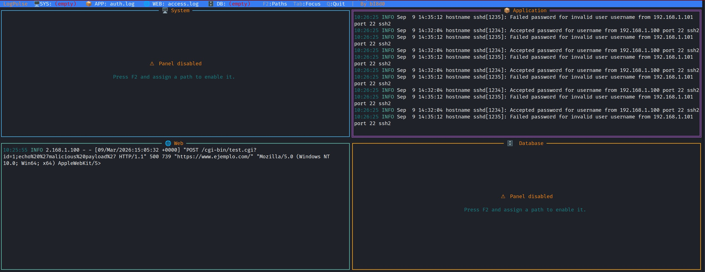

<div align="center">

# 🔍 LogPulse

### Real-time terminal log dashboard for Linux

[](https://go.dev/)
[](https://kernel.org/)
[](LICENSE)
[](https://github.com/rivo/tview)
[]()

> Monitor up to **4 log files simultaneously** in a beautiful 2×2 terminal dashboard.  
> Changes appear **instantly** — no refresh needed. Configure paths on the fly with `F2`.



</div>

---

## ✨ Features

- 📺 **4-panel dashboard** — Monitor four log sources simultaneously in a 2×2 grid
- ⚡ **Real-time tail** — Each panel follows its log file like `tail -f`, updating as new lines appear
- 🎨 **Color-coded severity** — Lines are automatically highlighted by level: `ERROR`/`FATAL` in red, `WARN` in yellow, `DEBUG` in cyan, `INFO` in white
- ⚙️ **Persistent configuration** — Paths are saved to `logpulse.conf` and restored on next launch
- 🚫 **Graceful disabled panels** — Empty paths show a centred ⚠ message instead of crashing
- ⌨️ **Full keyboard control** — Navigate, edit paths and quit without leaving the terminal
- 🔄 **Hot-reload paths** — Change any log path at runtime with `F2`; only the affected panel restarts
- 📂 **Auto file-wait** — If a file doesn't exist yet, the panel keeps retrying every 2 seconds until it appears

---

## 🎨 Log Severity Colours

| Level | Keywords detected (case-insensitive) | Colour |
|-------|--------------------------------------|--------|
| 🔴 ERROR | `ERROR`, `FATAL`, `CRITICAL`, `CRIT` | Red |
| 🟡 WARN | `WARN`, `WARNING` | Yellow |
| 🔵 DEBUG | `DEBUG`, `TRACE` | Cyan |
| ⚪ INFO | *(everything else)* | White |

Detection is automatic — no parser configuration needed.

---

## 📐 Dashboard Layout

```
┌──────────────────────────────────────────────────────────────────────────────┐
│  LogPulse  🖥 SYS: syslog  📦 APP: auth.log  🌐 WEB: access.log 🗄 DB: er.log│
│                        F2:Paths  Tab:Focus  Q:Quit  |  By bI8d0              │
├─────────────────────────────────────┬────────────────────────────────────────┤
│                                     │                                        │
│   🖥  System                        │   📦 Application                       │
│                                     │                                        │
│   [ tail -f /var/log/syslog ]       │   [ tail -f /var/log/auth.log ]        │
│                                     │                                        │
│   INFO  kernel: eth0 link up        │   INFO  Accepted password for root     │
│   WARN  disk usage at 85%           │   WARN  Failed password attempt        │
│   ERROR kernel: Out of memory       │   ERROR PAM authentication failure     │
│   ...                               │   ...                                  │
│                                     │                                        │
├─────────────────────────────────────┼────────────────────────────────────────┤
│                                     │                                        │
│   🌐 Web                            │   🗄  Database                          │
│                                     │                                        │
│   [ tail -f nginx/access.log ]      │   [ tail -f mysql/error.log ]          │
│                                     │                                        │
│   INFO  GET /api/v1 200 12ms        │   INFO  InnoDB: start up complete      │
│   INFO  POST /login 302 8ms         │   WARN  Slow query: 3200ms             │
│   ERROR GET /admin 403 1ms          │   ERROR Table 'db.users' not found     │
│   ...                               │   ...                                  │
│                                     │                                        │
└─────────────────────────────────────┴────────────────────────────────────────┘
```

| Panel | Icon | Key | Example log path | Border colour |
|-------|------|-----|-----------------|---------------|
| System | 🖥 | `SYS` | `/var/log/syslog` | 🟦 Teal |
| Application | 📦 | `APP` | `/var/log/auth.log` | 🟣 Purple |
| Web | 🌐 | `WEB` | `/var/log/nginx/access.log` | 🟢 Green |
| Database | 🗄 | `DB` | `/var/log/mysql/error.log` | 🟠 Orange |

---

## ⌨️ Keyboard Shortcuts

| Key | Action |
|-----|--------|
| `F2` | Open / close the **Configure Paths** modal |
| `Tab` | Cycle focus between the four panels |
| `Q` / `q` | Quit LogPulse |
| `Ctrl+C` | Force quit |
| `↑ / ↓` | Scroll the focused panel |

> **Inside the F2 modal:**  
> `Tab` moves between fields · `Enter` activates the focused button · `Esc` cancels and restores the previous paths

---

## ⚙️ Configuration

LogPulse stores its configuration in **`logpulse.conf`**, located in the same directory as the binary.  
The file is created automatically on first launch with the example paths.

```ini
# LogPulse - Log file path configuration
# Leave a value empty to disable that panel

sys = /var/log/syslog
app = /var/log/auth.log
web = /var/log/nginx/access.log
db  = /var/log/mysql/error.log
```

### Rules

- **Empty value** → the panel shows the ⚠ *Panel disabled* message and does not tail any file.
- Changes made through `F2` are **saved automatically** when you press **✔ Apply**.
- You can also edit the file manually before starting LogPulse.
- A custom path can be passed at launch time:

```bash
./logpulse --conf /etc/logpulse/custom.conf
```

---

## 🚀 Getting Started

### Prerequisites

| Tool | Minimum version |
|------|----------------|
| [Go](https://go.dev/dl/) | 1.21+ |
| Linux (amd64) | Any modern distro |

> LogPulse is a **Linux-only** binary — it reads Linux log files and uses terminal escape codes.  
> The *build* toolchain can run on macOS or Linux.

> 💡 **Recommended terminal:** [Terminator](https://gnome-terminator.org/) — its multi-pane layout pairs perfectly with LogPulse's 2×2 dashboard. Make sure to maximise the window for the best experience.
>
> ```bash
> # Install Terminator (Debian / Ubuntu)
> sudo apt install terminator
>
> # Launch LogPulse inside Terminator
> terminator -e "./logpulse"
> ```

### Build from source (Linux)

```bash
git clone https://github.com/bI8d0/LogPulse.git
cd LogPulse

# Download dependencies
go mod tidy

# Compile
go build -ldflags="-s -w" -o logpulse .

# Run
./logpulse
```

### Cross-compile from macOS

A helper script (`build.go`) is included that handles the cross-compilation automatically:

```bash
# macOS
go run build.go
```

This will:
1. Run `go mod tidy` to fetch all dependencies
2. Cross-compile with `GOOS=linux GOARCH=amd64 CGO_ENABLED=0`
3. Output a static binary named `logpulse` in the project root

Transfer the binary to your Linux server and run it:

```bash
scp logpulse user@server:/usr/local/bin/
ssh user@server "chmod +x /usr/local/bin/logpulse && logpulse"
```

---

## 🗂️ Project Structure

```
LogPulse/
├── main.go                    # Entry point
├── build.go                   # Cross-compilation helper (go run build.go)
├── go.mod / go.sum            # Go module files
├── logpulse.conf              # Runtime configuration (auto-generated)
└── internal/
    ├── config/
    │   └── config.go          # Config struct, Load(), Save(), ReadFile()
    ├── parser/
    │   └── log_entry.go       # LogEntry type, AutoParser (level detection)
    ├── ui/
    │   ├── app.go             # Application wiring, Run(), panel lifecycle
    │   ├── layout.go          # 2×2 grid + top-bar layout
    │   ├── menubar.go         # Top menu bar + F2 config modal (BuildConfigModal)
    │   └── panel.go           # Panel widget, StartListening(), ShowDisabled
    └── watcher/
        ├── tailer.go          # tail -f implementation (goroutine per panel)
        └── dispatcher.go      # Event dispatcher
```

---

## 🧩 Architecture

```
main.go
  └─▶ config.Load()              reads logpulse.conf (creates it if missing)
  └─▶ ui.NewApp(cfg)
        └─▶ NewPanel × 4         create tview.TextView widgets
        └─▶ NewMenuBar            top info bar
  └─▶ app.Run()
        ├─▶ initPanel × 4        synchronous setup BEFORE event loop
        │     ├─▶ Panel.ShowDisabledDirect()    if path is empty
        │     └─▶ watcher.NewTailer(path, ch)   if path is set
        │           └─▶ Tailer.Start()          goroutine: tail -f ──▶ ch
        │     └─▶ Panel.StartListening(ch)      goroutine: ch ──▶ tview widget
        ├─▶ BuildConfigModal      F2 modal (hot-reload on Apply)
        ├─▶ BuildLayout           tview 2×2 grid
        └─▶ tviewApp.Run()        blocking event loop
```

### Key design decisions

| Decision | Reason |
|----------|--------|
| `initPanel` runs *before* `tviewApp.Run()` | Avoids `QueueUpdateDraw` deadlock on startup |
| `restartPanel` runs *inside* the event loop | Called from button callbacks — writes directly to the widget, no queue needed |
| Channel buffer of 200 entries | Smooths log bursts without blocking the tailer goroutine |
| `atomic.Bool` for disabled state | Lock-free check inside the `SetDrawFunc` paint callback |
| `generation` atomic counter | Allows a new `StartListening` goroutine to detect stale channels and exit cleanly |
| `onClose` callback in `BuildConfigModal` | Guarantees focus always returns to the active panel after F2 is dismissed |

---

## 📦 Dependencies

| Package | Version | Purpose |
|---------|---------|---------|
| [github.com/rivo/tview](https://github.com/rivo/tview) | v0.42.0 | Terminal UI widgets (TextView, Form, Pages, Flex, Grid) |
| [github.com/gdamore/tcell/v2](https://github.com/gdamore/tcell) | v2.13.8 | Terminal cell rendering & keyboard events |

All dependencies are vendored via `go.sum` — no internet required at build time after `go mod tidy`.

---

## 🐛 Known Limitations

- Designed for **Linux** log files only.
- Very large log files (>1 GB) are not seeked backwards; only *new* lines appear after the binary starts.
- No regex filtering or search yet (planned feature).

---

## 🗺️ Roadmap

- [ ] Regex filter per panel
- [ ] In-panel search / highlight (`/` key)
- [ ] Export visible log lines to a file
- [ ] Configurable colour themes
- [ ] ARM64 build target
- [ ] systemd service example

---

## 📄 License

Distributed under the MIT License. See [`LICENSE`](LICENSE) for details.

---

<div align="center">
Made with ❤️ by <strong>bI8d0</strong>
</div>
